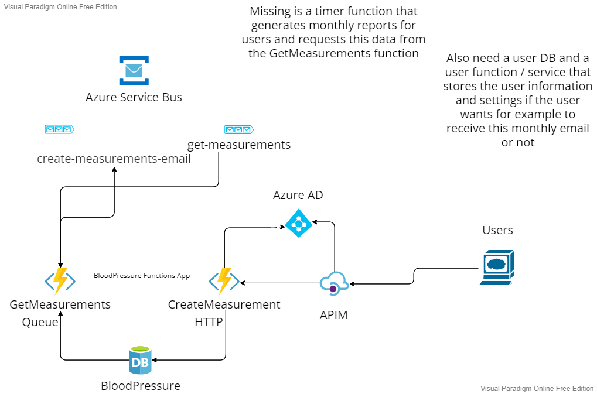

# BloodPressure

A skeleton and a WIP for an app where the user can insert blood pressure measurements, view the results and get monthly email reports about the measurements.

At some point the target would be that the user would snap a picture of the screen of the measuring device, it would be uploaded to a cloud storage, the numbers extracted from the image using some AI OCR for example and stored as a new entry.

## Notes:

- SQL database not really needed for this since it's basically a single table of data. There can be some queries against the data but the amount of rows will be small per user so any DB could work here to be honest.
- The HTTP triggers should be behind some API gateway / APIM that handles the auth. Could not figure out a way to force some kind of redirect to auth in localhost. The token should be gotten by some other means. Testing locally works with the workaround.
- Not sure how to add some proper api exception filters to the functions or to use some try catch per function
- A few simple integration tests per function. The testing part would need some helper methods etc.
- Missing the other simple CRUD stuff: delete / update
- Startup is missing automatic migrations. I did by hand for localhost, could be added if needed.

A small diagram on how it would look like. Only includes what is added at this point.

